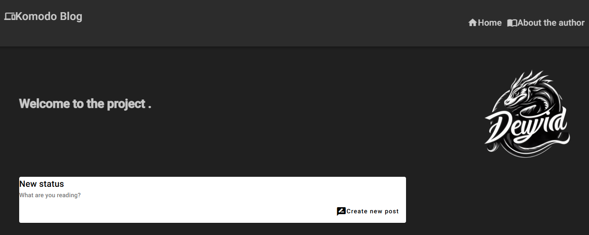
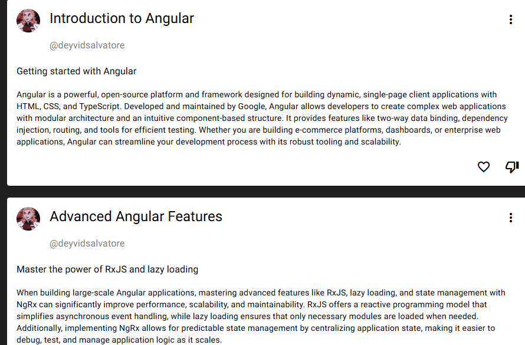

# Komodo Blog - Mock Blog


## 📝 Description

The **Komodo Blog** is a web application developed with **Angular** that simulates basic blog functionalities. It allows users to create, view, edit, and delete posts. This application is ideal for learning purposes, prototyping, and practicing HTTP service integration, state management, and using Angular Material.

---

## 🚀 Features

- **Create New Posts:**  
  Allows users to create a new post by entering information like title, subtitle, content, and associated user.
  
- **Edit Posts:**  
  Enables editing of any existing post via a responsive modal.

- **Delete Posts:**  
  Allows deleting posts directly from the user interface.

- **Responsive Interface:**  
  Optimized for mobile devices, tablets, and desktops to ensure a seamless user experience.

- **Feedback Messages:**  
  Integrated with Angular Material's messaging system to provide quick feedback to users.

---

## 🛠️ Technologies Used

- **Frontend:**  
  - Angular 19+
  - Angular Material  
  - RxJS for reactivity and event handling.
  - Angular Forms (Template-driven forms and reactive state).

- **HTTP Requests:**  
  Using `provideHttpClient()` for REST service integration.

- **UI/UX:**  
  Using Angular Material to create beautiful, modern, and responsive components.

## 🛠️ Setup and Run Instructions
1. Clone the Repository
```bash
git clone https://github.com/your-username/komodo-blog.git
cd komodo-blog
```
2. Install Dependencies
```bash
npm install
```
3. Start
```bash
npm start
```
## 📄 Technologies & Tools

### ⚙️ Tools Used:

- **Angular CLI:**  
  A command-line tool for initializing and developing Angular applications.

- **Angular Material:**  
  UI framework for building responsive and accessible user interfaces.

- **RxJS:**  
  Reactive programming with observables for asynchronous event handling.

---

## 💬 Contributing

We welcome contributions! If you would like to contribute, feel free to submit a **Pull Request**.  
If you find any bugs or have suggestions, please open an **Issue** on the repository.

---

## 🏆 License
Distributed under the **MIT License**. See the [LICENSE](https://mit-license.org/) for details.
